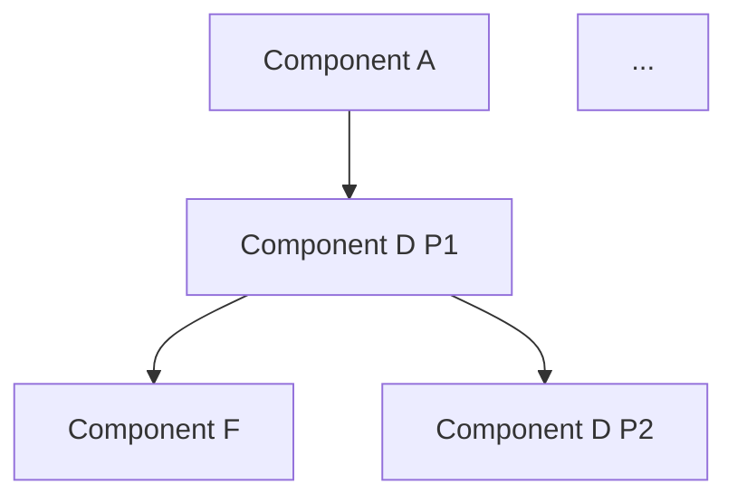

# Task Planning (from Design Docs)

Turn a completed technical design into an actionable implementation plan with dependency
analysis, parallelization strategy, and individual task files.

## How This Skill Fits the Development Pipeline

```
technical-design
  → Produces: high-level architecture + component specs
  │
  ▼
task-planning (THIS SKILL)
  → Reads: design docs (high-level + component specs)
  → Produces: planning doc + implementation tasks + verification tasks
  │
  ▼
scenario-driven-dev (per task, possibly in parallel worktrees)
  → Takes each task as input
  → Runs: requirements → design → implement → test → review
```

The technical-design skill does the thinking. This skill does the organizing. The
scenario-driven-dev skill does the building.

______________________________________________________________________

## Principle 0: Review Before You Build

**Every person or agent who picks up a task MUST review the referenced design docs first
and form their own judgment before writing code.**

Design docs and task files are starting points, not gospel. Things change between design
time and implementation time. The agent or developer working on a task should:

1. **Read the referenced design docs** (high-level design + the component spec for this task).
1. **Assess whether the design still makes sense.** Ask: "Does this approach hold up now
   that I'm looking at the actual code and constraints?"
1. **If something doesn't make sense** — raise it. Update the design doc, adjust the task,
   or flag it for discussion. Don't silently comply with a design decision that seems wrong.
1. **If it makes sense** — proceed with confidence. The design doc gives you the *why*
   behind decisions, which helps you make good judgment calls in edge cases the spec didn't
   explicitly cover.

This principle applies to the agent running this skill too. While analyzing the design docs,
if you spot inconsistencies, gaps, or decisions that seem questionable, call them out to the
user before producing the plan.

______________________________________________________________________

## Step 0: Locate the Design Docs

The user will point you to a design folder (typically `docs/design/<feature-name>/`). Read
all files in the folder:

1. **High-level design** (e.g., `high-level-design.md`) — system overview, component
   inventory, interface contracts, key decisions.
1. **Component specs** (e.g., `<component-a>.md`, `<component-b>.md`) — one per component,
   each with phases, dependencies, and definition of done.
1. **Migration section** (Section 12 in the high-level design, if present) — lists code to
   remove, code to keep, and migration steps. This section exists when the design was
   updated from a previous version (see technical-design skill, Step 0.5). If present,
   you must generate **cleanup tasks** in addition to implementation tasks — see Step 4.

If the design folder doesn't exist or is incomplete, tell the user. This skill requires
finished design docs — use the **technical-design** skill
(`.claude/skills/technical-design/SKILL.md`) to produce them first.

______________________________________________________________________

## Step 1: Analyze Dependencies

Read each component spec and extract:

- **Component name** and complexity (small / medium / large)
- **Number of phases** within the component (many components will be single-phase — this
  is expected and preferred for Opus 4.6 1M, which can handle ~25 files in one session)
- **Phase-level dependencies** — what each phase depends on (from other components or
  phases within the same component)
- **Key interfaces** — what does this phase produce that other phases consume?
- **Verification implications** — which seams can be proven inside the task versus which require
  later feature-level runtime, browser, or manual verification

Build a dependency graph at the **phase level**, not the component level. For multi-phase
components, Phase 1 may start early (few deps) while Phase 3 waits for other components.
For single-phase components, the component _is_ the task — no further decomposition needed.

### Where to Find Dependencies

Component specs declare dependencies in several places:

- **Phase breakdown tables** — usually have a "Dependencies" column
- **"Interactions with Other Components"** section — shows what the component consumes
- **"Definition of Done"** — references to other components' outputs
- **"Existing Code to Use"** table — shows what shared code is needed (usually already
  exists, so not a blocking dependency)

### Dependency Types

| Type     | Meaning                                            | Example                                                       |
| -------- | -------------------------------------------------- | ------------------------------------------------------------- |
<!-- CUSTOMIZE: Replace the examples below with components from your project.
  An onboarding agent should read the project's design docs to find real component names.
  Example: "Payment Service depends on User API Phase 1 (needs data models)" -->
| **Hard** | Cannot start without this                          | Component C depends on Component A Phase 1 (needs data models) |
| **Soft** | Can start with mocks, needs real integration later | Component A Phase 2 can mock the Component B interface         |
| **None** | Fully independent                                  | Component D has no internal dependencies                       |

For planning purposes, treat soft dependencies as non-blocking — the task can start with
mocks and integrate later. Note the mock requirement in the task file.

______________________________________________________________________

## Step 2: Build the Dependency Graph

Organize phases into **parallel waves** — groups of tasks that can execute concurrently
because they have no inter-dependencies.

### Algorithm

1. Start with all phases that have **no dependencies** → Wave 1.
1. For each subsequent wave: include phases whose dependencies are all satisfied by
   previous waves.
1. Continue until all phases are assigned to a wave.

### Output Format

Present the graph in two forms:

**1. Wave table** — for quick scanning:

```markdown
| Wave | Tasks (can run in parallel) | Depends on |
|------|---------------------------|------------|
| 1    | Component A, Component B, Component C P1 | — |
| 2    | Component D P1, Component E | Wave 1 |
| 3    | Component F, Component D P2 | Wave 2 |
| ...  | ... | ... |
```

**2. Mermaid dependency diagram** — for visual understanding:



______________________________________________________________________

## Step 3: Write the Planning Document

Save to: `docs/design/<feature-name>/implementation-plan.md`

Use the template in `references/planning-doc-template.md`. The planning doc contains:

1. **Summary** — one paragraph: what's being built, how many tasks, estimated waves.
1. **Design Doc Inventory** — table listing every design doc with its path and scope.
1. **Dependency Graph** — the wave table and mermaid diagram from Step 2.
1. **Task List** — a numbered list of every task with: name, component, phase, priority,
   dependencies (by task number), estimated scope (files touched), and design doc reference.
1. **Verification Strategy** — identify which proof happens inside implementation tasks and which
   follow-up verification tasks should exist after the feature is assembled.
1. **Parallelization Notes** — which tasks can share a wave, which must be sequential, and
   why. Call out soft dependencies that enable earlier starts with mocks.
1. **Risk Notes** — any concerns spotted during analysis (e.g., a component spec that seems
   under-specified, a dependency chain that's unusually long, a phase that might be too
   large for a single agent session).

**Present the planning doc to the user and get approval before creating task files.** The
user may want to reorder, merge, split, or reprioritize tasks.

______________________________________________________________________

## Step 4: Create Task Files

After the user approves the plan, create individual task files in `docs/tasks/`.

Do not stop at implementation tasks if the design says the feature will be built across
multiple components or waves. The plan should also create:

- An **overall review** task — runs after implementation waves finish; checks design alignment
  and cross-component integration
- A **test coverage review** task — runs after the overall review; maps covered vs partial vs
  missing proof and refines the verification backlog
- **Verification tasks** derived from the verification plan — created now, executed after the
  coverage review. Common types:
  - Backend runtime/integration verification after multiple services or modules are wired together
  - Browser E2E verification when the feature includes meaningful UI behavior
  - Recovery/manual verification for infrastructure-heavy flows that are hard to prove in CI

### Verification-Task Lifecycle

Verification tasks are **planned early but executed late**:

1. **Created during task planning** — so the work is visible, sized, and dependency-tracked
   from the start. They appear on the task board alongside implementation tasks.
1. **Blocked until implementation is done** — their `depends_on` should include the last
   implementation wave.
1. **Refined after overall review + coverage review** — the coverage review may split, merge,
   add, or cancel verification tasks based on what the overall review discovered.
1. **Executed after the coverage review confirms scope** — this is the first time they run.
1. **May spawn fix tasks** — if verification fails, the fix is a new task, not a retry of the
   verification task.

### Standard Post-Implementation Tasks

For any feature with 4+ components or multiple waves, the plan should always create at least
these three post-implementation tasks:

| Task                                            | Depends on               | Purpose                                       |
| ----------------------------------------------- | ------------------------ | --------------------------------------------- |
| Overall review                                  | All implementation tasks | Design alignment + integration review         |
| Test coverage review                            | Overall review           | Map proof status, refine verification backlog |
| (Verification tasks from the verification plan) | Coverage review          | Close the remaining proof gaps                |

The overall review and coverage review are mandatory stages, not optional polish.

### Cleanup Tasks (When Migration Section Exists)

When the high-level design contains a **"Migration from Previous Design"** section (Section
12), the plan must also generate **cleanup tasks** that explicitly remove legacy code. This
is the mechanism that prevents stale code from surviving a redesign.

**How to generate cleanup tasks:**

1. Read Section 12.2 ("Code to Remove") — each row becomes cleanup work.
2. Read Section 12.3 ("Code to Keep") — these are exclusions the cleanup task must respect.
3. Read Section 12.4 ("Migration Steps") — this determines the ordering of cleanup tasks
   relative to implementation tasks.

**Cleanup task structure:**

- **Scope:** List the specific files, classes, functions, routes, and tests to delete.
- **Exclusions:** List any code from "Code to Keep" that touches the same area.
- **Verification:** After removal, run tests and grep for any remaining references to the
  removed modules. The task is not done until no dangling references remain.
- **Dependencies:** Cleanup tasks must depend on the implementation tasks that provide the
  replacement. Never remove old code before the new code is deployed.

**Sequencing rules:**

- Cleanup tasks go in **later waves** — after the implementation wave that provides the
  replacement code.
- If the migration section specifies an order (e.g., "remove X after Y is deployed"),
  respect that ordering.
- Group related removals into a single cleanup task when they touch the same module or
  feature area. Don't create one task per file — that's too granular.

**Naming convention:**

`docs/tasks/YYYY-MM-DD-<feature>-w<wave>.<seq>-cleanup-<area>.md`

Example: `docs/tasks/2026-04-16-my-feature-w5.1-cleanup-old-module.md`

**Standard post-implementation tasks table (updated):**

| Task                                            | Depends on                    | Purpose                                       |
| ----------------------------------------------- | ----------------------------- | --------------------------------------------- |
| Cleanup tasks (from migration section)          | Replacement implementation    | Remove legacy code, dead imports, old tests   |
| Overall review                                  | All impl + cleanup tasks      | Design alignment + integration review         |
| Test coverage review                            | Overall review                | Map proof status, refine verification backlog |
| (Verification tasks from the verification plan) | Coverage review               | Close the remaining proof gaps                |

<!-- CUSTOMIZE: Replace this block with your project's task file storage strategy.
  An onboarding agent should check whether `docs/tasks/` is gitignored, whether the project
  uses worktrees with shared task directories, and how task files are persisted.
  Example: if your project gitignores `docs/tasks/` and uses a shared directory across
  worktrees, describe the symlink setup here. If tasks are committed, say so instead. -->
> **Important:** Task files in `docs/tasks/` are ephemeral work trackers. The planning doc
> (`implementation-plan.md`) and design docs ARE committed and serve as the durable record.
> Check your project's `.gitignore` and worktree setup to understand whether task files are
> committed or shared via symlink. The worktree-mgmt skill handles worktree-specific setup.

### Task File Philosophy

Task files for design-derived work are **lightweight pointers, not duplicates.** The design
docs already contain the detailed context, data models, API specs, and definition of done.
The task file's job is to:

1. **Scope the work** — which component, which phase, what's included and excluded.
1. **Point to the design docs** — so the agent reads the full context.
1. **Declare dependencies** — so the task board shows the correct order.
1. **Set expectations** — tell the agent to review the design, use SDD, and raise concerns.
1. **Preserve feature-level verification intent** — record any deferred integration assumptions
   and point to later verification tasks when the implementation task cannot provide full proof.

Use the template in `references/task-from-design-template.md`.

### Key Sections in Each Task File

- **Context** — 2-3 sentences: what this task implements and why it matters.
- **Scope** — what's included in this task (from the phase breakdown in the design doc).
- **Design References** — paths to the design docs the agent must read before starting.
- **Dependencies** — `depends_on` frontmatter linking to prerequisite task IDs.
- **Implementation Guidance** — MUST include the SDD skill reference: "Use
  **scenario-driven-dev** (`.claude/skills/scenario-driven-dev/SKILL.md`) for the
  implementation workflow." This is a required element — every design-derived task must tell
  the implementing agent to follow SDD. Add brief notes on approach, mock boundaries, or
  patterns. Don't repeat the design doc.
- **Deferred Integration Assumptions** — list any interfaces that will be mocked or temporarily
  stubbed so downstream reviewers know what still needs real integration proof.
- **Verification Follow-Ups** — say whether this task fully proves its slice or whether separate
  backend runtime, browser E2E, or manual verification tasks are expected later.
- **Acceptance Criteria** — copied or summarized from the design doc's Definition of Done
  for this phase. These should be testable.

### Execution Mode: Automated Agent vs. Human

When creating tasks from a design plan, consider which tasks are suitable for automated
agent dispatch and which require human execution. As a quick guide: automated dispatch
suits well-scoped coding tasks with no local-only deps or open design decisions; human
execution suits anything involving interactive debugging, browser testing, infrastructure
changes, or design judgment.

<!-- CUSTOMIZE: Replace with your project's dispatch mechanism and command.
  An onboarding agent should check for dispatch scripts, CI-based agent runners, or
  slash commands in the project's tooling.
  Example: if your project has `scripts/dispatch-task.py` or a `/dispatch-task` command,
  reference it here. If no dispatch mechanism exists, remove the dispatch hints. -->

Add a one-line execution hint to the **Implementation Guidance** section of each task file
(not frontmatter):

- Automated agent candidate: `"This task is suitable for automated agent dispatch."`
- Human only: `"This task requires human execution (interactive debugging / browser testing / design decisions needed)."`

**For Wave 1 tasks** (no dependencies): if they are suitable for dispatch, call this out
explicitly in the Step 5 report — these can be dispatched immediately after plan approval
without waiting for any prerequisites.

### Creating Tasks Efficiently

Use **subagents** (Task tool) to create multiple task files in parallel. Each subagent
receives:

- The task metadata (title, slug, priority, dependencies, related tasks)
- The design doc path to reference
- The phase-specific scope and acceptance criteria
- The **full template** from `references/task-from-design-template.md` — include it verbatim
  in the subagent prompt so it can follow the exact format. Do NOT paraphrase the template
  or omit sections (especially the SDD skill reference in Implementation Guidance).

Launch up to 4 subagents concurrently. Each subagent creates one task file.

### Naming Convention

Task files derived from an implementation plan use a **wave prefix** to show execution order:

`docs/tasks/YYYY-MM-DD-<feature>-w<wave>.<seq>-<component>.md`

- `<wave>`: the wave number from the implementation plan (1, 2, 3, ...)
- `<seq>`: sequence within the wave (1, 2, 3, ...) for deterministic sort order

Examples:

- `docs/tasks/2026-03-12-my-feature-w1.1-component-a.md` (Wave 1, first task)
- `docs/tasks/2026-03-12-my-feature-w4.1-component-d-p1.md` (Wave 4, first task)

This way `ls docs/tasks/` naturally shows tasks in execution order, and tasks within
the same wave sort together (making it obvious which can run in parallel).

For ad-hoc tasks not derived from a design plan, use the simpler format from the
create-task skill: `docs/tasks/YYYY-MM-DD-<slug>.md`

______________________________________________________________________

## Step 5: Verify and Report

After all task files are created:

<!-- CUSTOMIZE: Replace with your project's task board command.
  An onboarding agent should check for task board scripts in `scripts/`, `tools/`, or
  project bin directories. If none exists, remove this step or note that manual verification
  of the dependency graph is needed.
  Example: `python scripts/task-board.py --graph` -->
1. **Run the task board** (if available) to verify the dependency graph. Check for a task
   board script in the project's `scripts/` or `tools/` directory. If no task board exists,
   manually verify the dependency graph by reviewing the task files and their `depends_on`
   frontmatter.

1. **Report to the user:**

   - Total tasks created
   - The dependency graph (text or mermaid)
   - Which tasks can start immediately (Wave 1)
   - Suggested first tasks to pick up
   - **Which Wave 1 tasks are suitable for immediate dispatch** (if an automated dispatch
     mechanism is available in the project)
   - The overall review and coverage review tasks that will run after implementation
   - Which verification tasks are planned but blocked until after the coverage review
   - Remind: "Each agent should read the design docs and review them before starting work.
     Use scenario-driven-dev for implementation."

______________________________________________________________________

## Principles

### 1. Don't Duplicate — Reference

The design docs are the source of truth. Task files point to them. If a task file repeats
detailed data models, API specs, or architectural reasoning from the design doc, it will
drift out of sync. Keep task files thin.

### 2. Prefer Fewer, Larger Tasks Over Many Small Ones

With Opus 4.6 1M context, the model can comfortably handle ~20 acceptance criteria,
~2000 lines of changes, and up to 25 files in a single task. Use this capacity to
create fewer, more cohesive tasks rather than splitting along arbitrary boundaries.

**Default: one task per component.** Most components should be single-phase and map
directly to one task. Only split into phase-level tasks when the design doc explicitly
defines multiple phases — which should only happen when phases are truly independent
concerns, not segments of one linear flow. Don't artificially split a single-phase
component into multiple tasks.

**Merge tightly coupled tasks.** Before finalizing the task list, evaluate adjacent
tasks for merge opportunities. Tasks should be merged when:

- One task produces infrastructure that only the other consumes (e.g., mock server +
  tests, schema migration + API endpoint). The producer has no standalone value.
- The tasks represent a single logical feature that would naturally be one PR.
- The combined size stays within Opus 1M limits (~20 acceptance criteria, 25 files).

Tasks should stay separate when they use different tooling/environments (e.g., pytest
vs. browser E2E), have different execution modes (automated agent vs. human-only), or
produce independently valuable artifacts.

### 3. Every Task Starts with Review

The first line of every task's implementation guidance should tell the agent to read and
review the design docs. Design docs capture decisions made at a higher level of abstraction.
Implementation often reveals issues that weren't visible during design. The agent should
flag these, not silently comply.

### 4. Soft Dependencies Enable Parallelism

When a dependency is "soft" (can be mocked), mark it in the task file. This lets agents
start work earlier — they mock the dependency, build their component, and integrate later
when the real dependency is available.

### 5. The Plan Is a Living Document

The planning doc and task files may need updates as implementation progresses. If an agent
discovers that a task is too large, too small, or has a missing dependency, update the
planning doc and create/modify task files accordingly.

### 6. Feature Closure Requires Verification Planning

Per-task completion is not the same as feature closure. If the feature spans multiple
components, services, or UI/backend seams, the plan must include:

- An overall review task (mandatory)
- A test coverage review task (mandatory)
- Verification tasks from the verification plan (created now, executed after coverage review)

These are created up front so the work is visible and sized from the start, but they are
executed in order after implementation waves finish. The coverage review is the bridge between
the original verification plan and the actual executable verification scope.

______________________________________________________________________

## Important: Working on Design-Derived Tasks

> **Every agent picking up a task from this plan MUST read this section.**

1. **Check out Scenario-Driven Development.** Each task's Implementation Guidance already
   references the SDD skill (`.claude/skills/scenario-driven-dev/SKILL.md`), but make sure
   you actually read and internalize it — don't just acknowledge the reference.

1. **Leverage existing design docs — don't skip them, deepen them.** The task comes with
   detailed design docs (high-level architecture + component specs) and requirement docs.
   Treat these as **high-level guidance**. You *can* skip re-doing them from scratch in SDD
   Phases 1-2, but you should still consider writing **more detailed, implementation-level**
   design notes if the upstream docs lack concrete scenarios, data models, or edge cases.
   The upstream design captures the *what* and *why* at a system level — your job is to
   fill in the *how* at the code level.

1. **Make a good estimate before diving in.** This is the highest-granularity task in the
   feature, defined from the high-level design. Before writing code, review the design docs,
   assess the scope, and form your own estimate of effort and complexity. Use your best
   judgment based on the design information, but don't blindly trust scope estimates from
   the planning phase — things change at implementation time.

1. **Tests must be comprehensive.** The design docs and requirements define the expected
   behavior. Your tests must cover all of it — every scenario, every edge case, every
   acceptance criterion. Don't settle for happy-path-only coverage. If the design doc says
   it, the tests should verify it.

1. **Be explicit about what is still unproven.** If a task relies on mocks, temporary seams,
   or partially implemented neighbors, record that in the task file and make sure the plan
   includes the later verification task that will close the gap.

1. **Spin up subagents for isolated subtasks.** If you identify work that is relatively
   isolated (e.g., writing a utility module, creating test fixtures, building a standalone
   component), spin up a subagent (Task tool) to handle it. This saves your own context
   window for the mainstream/core logic. **Always keep the core business logic and main
   integration flow in your own context window** — delegate the periphery, not the center.

______________________________________________________________________

## References

- Planning document template: `references/planning-doc-template.md`
- Task file template (design-derived): `references/task-from-design-template.md`
- Technical design skill: `.claude/skills/technical-design/SKILL.md`
- Scenario-driven-dev skill: `.claude/skills/scenario-driven-dev/SKILL.md`
- Create task skill: `.claude/skills/create-task/SKILL.md`
- Worktree management skill: `.claude/skills/worktree-mgmt/SKILL.md`
